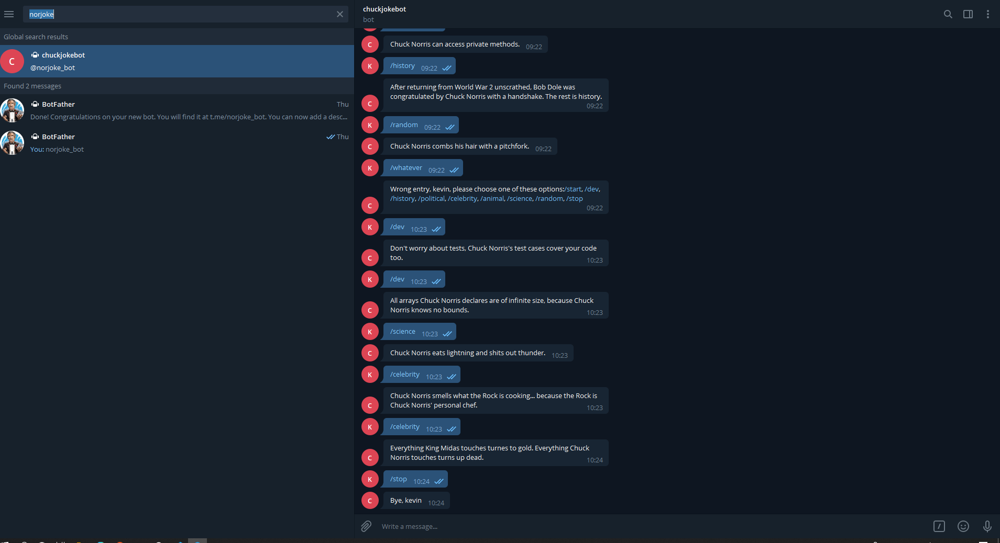

# Chuck Norris telegram bot

> Nowadays people work so hard every day. Laughing is one of the best therapies to relax. For that reason this is a bot for telegram built in order to take a rest and laugh with some jokes related to chuck norris and different categories.

## :video_camera: Video Presentation

[Video Demo Link](https://www.loom.com/share/3951b72cfd714963808aa9f5d9d0ba1c)

## :hammer: Built with

- Ruby
- Ruby gem Telegram-bot,
- Ruby gem RSpec
- Ruby gem bundler
- Ruby gem rest-client
- Linters
- VS code

## 📝 Pre-requisites

- Ruby -v2.7.0p0

## :construction_worker: Getting Started

To get a local copy up and running follow these simple steps:

- Go to the main page.
- Press the "Code" button and get the repo link.
- Clone it using git command "git clone &lt;link>".

## 📝 Setup

- Open the terminal.
- Install dependencies using: `bundler install`
- Run the program using: `ruby bin/main.rb`
- Stop the program with: `"Ctrl + C" (windows and Linux) or "Command + C" (Apple)`

## 📝 How to use the bot'?'

- When the program is running go to telegram.

- Search for: @chuckjokebot

- click on start

- Follow instructions

- Enjoy and laugh :laughing:

## :bust_in_silhouette: Author

👤 **Kevin Cotrina**

- Github: [@kcotrinam](https://github.com/kcotrinam)
- Twitter: [@KevinCot12](https://twitter.com/KevinCot12)
- Linkedin: [linkedin](https://www.linkedin.com/in/kevin-cotrina-6208b7149/)

## 🤝 :raised_hand: :raised_hand: Contributions

Contributions, issues and feature requests are welcome!

Feel free to check the [issues page](https://github.com/kcotrinam/telegram_bot_capstone/issues).

## :muscle: Show your support

Give a :star: if you like this project!.

## :grey_exclamation: Acknowlegment

- To [Microverse](https://www.microverse.org/)
- Stand up team

## 📝 License

This project is [MIT](./LICENSE) licensed.
